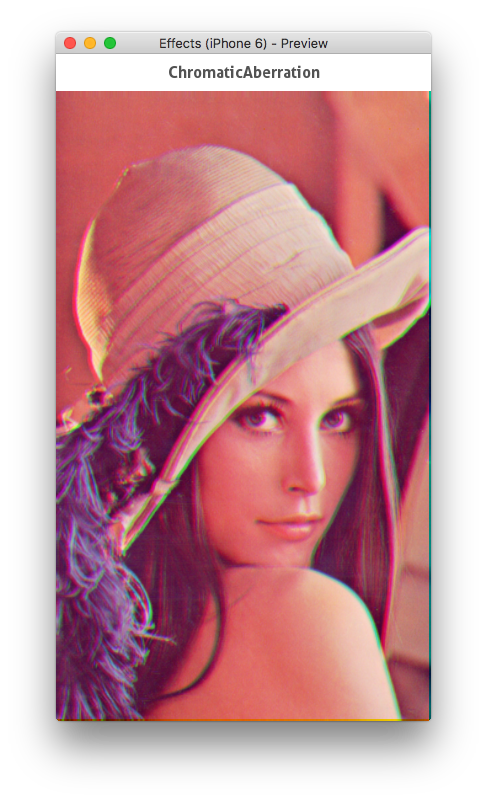

# FuseFX
Extra image effects for Fuse

## Background
[Fuse](http://fusetools.com) is built on a proprietary programming language called Uno, which is based off C# and adds a number of features for platform agnostic programming and easy access to hardware accelerated rendering features.

Because of this, Fuse has a post processing effects pipeline that is fairly easy to extend, with a little grit and intuition. This repo is a community effort to extend Fuse with more image effects.

## How to contribute
* Fork the repository
* Experiment
* Make pull requests vs the develop branch
* Bob's your uncle

## Adding to your project
Just clone this repo and add a project reference to it in your unoproj:
```
"Projects":[
  "../FuseFX/FuseFX.unoproj"
]
```

## Current effects

### Chromatic aberration


This effect applies a naive spatial distortion to the individual color components of the rendered element, offsetting colors from their original location. Each component has an `Offset` property, taking a 2-component comma separated float list corresponding to the X and Y offsets.

```UX
<Image File="foo.png">
  <ChromaticAberration OffsetR="2,0" OffsetG="-2,0" OffsetB="0,-2"/>
</Image>
```

### Color gain


Add and then multiply the color components of the element (`color = (color+add)*multiply`);
Each component can be manipulated individually or as a whole with a color input. 

```UX
<Image File="foo.png">
  <ColorGain MultiplyColor="0,1,1,1" />
</Image>
```

### ContrastSaturationBrightness


Apply Photoshop-style contrast, saturation and brightness modifiers in one effect.
Every property is a `float4` in a scalar range from 0 to 1. The range is unclamped for fun and weirdness. Go nuts.

```UX
<Image File="foo.png">
  <ContrastSaturationBrightness Contrast="2" Saturation="0" Brightness="2" />
</Image>
```

### Levels


Apply Photoshop-style color range remapping and gamma correction using input/output ranges and a gamma scalar.

```UX
<Image File="foo.png">
  <!-- Deepen red levels -->
  <Levels MinInput="0.4, 0.0, 0.0, 0.0" />
</Image>
```

### Grayscale


Convert to grayscale.

Algorithms:

- `Monochrome`
- `Average`, R+G+B / 3
- `Luma`, R * 0.2126 + g * 0.7152 + B * 0.0722
- `MaxDecomposition`, Max(R,G,B)
- `MinDecomposition`, Min(R,G,B)
- `Desaturate`, Max(R,G,B) + Min(R,G,B) / 2
- `RedChannel`, R
- `GreenChannel`, G
- `BlueChannel`, B

```UX
<Image File="foo.png">
  <Grayscale Algorithm="Average" />
</Image>
```
